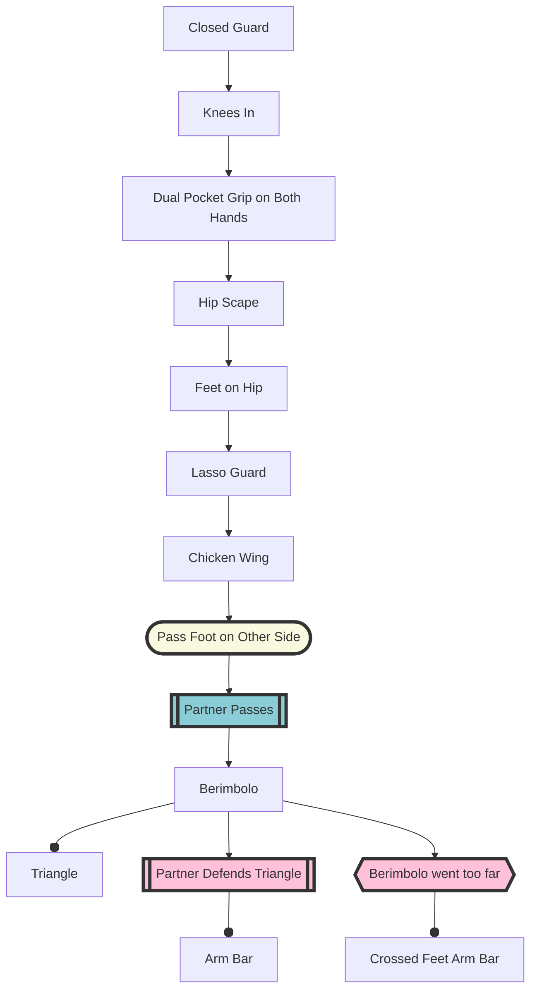

```mermaid
flowchart TD
    closed-guard[Closed Guard]
    knees-in[Knees In]
    dual-pocket-grip-on-both-hands[Dual Pocket Grip on Both Hands]
    hip-scape[Hip Scape]
    foot-on-hip[Feet on Hip]
    lasso-guard[Lasso Guard]
    chicken-wing[Chicken Wing]
    pass-foot-on-other-side([Pass Foot on Other Side])
    partner-passes[[Partner Passes]]
    berimbolo[Berimbolo]
    triangle[Triangle]
    partner-defends-triangle[[Partner Defends Triangle]]
    arm-bar[Arm Bar]
    berimbolo-went-too-far{{Berimbolo went too far}}
    crossed-feet-arm-bar[Crossed Feet Arm Bar]

	style pass-foot-on-other-side fill:#F9F9E0,stroke:#333,stroke-width:4px
	style partner-passes fill:#8ACDD7,stroke:#333,stroke-width:4px
	style partner-defends-triangle fill:#FFC0D9,stroke:#333,stroke-width:4px
	style berimbolo-went-too-far fill:#FFC0D9,stroke:#333,stroke-width:4px

    closed-guard --> knees-in --> dual-pocket-grip-on-both-hands --> hip-scape --> foot-on-hip --> lasso-guard --> chicken-wing --> pass-foot-on-other-side --> partner-passes --> berimbolo --o triangle

	berimbolo --> partner-defends-triangle --o arm-bar

	berimbolo --> berimbolo-went-too-far --o crossed-feet-arm-bar
```