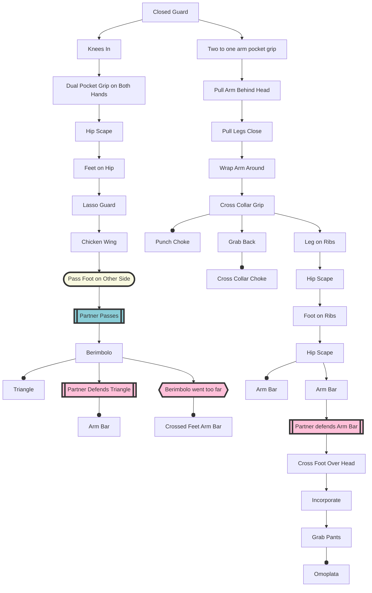

```mermaid
flowchart TD
    closed-guard[Closed Guard]
    knees-in[Knees In]
    dual-pocket-grip-on-both-hands[Dual Pocket Grip on Both Hands]
    hip-scape[Hip Scape]
    foot-on-hip[Feet on Hip]
    lasso-guard[Lasso Guard]
    chicken-wing[Chicken Wing]
    pass-foot-on-other-side([Pass Foot on Other Side])
    partner-passes[[Partner Passes]]
    berimbolo[Berimbolo]
    triangle[Triangle]
    partner-defends-triangle[[Partner Defends Triangle]]
    arm-bar[Arm Bar]
    berimbolo-went-too-far{{Berimbolo went too far}}
    crossed-feet-arm-bar[Crossed Feet Arm Bar]
    two-to-one-arm-pocket-grip[Two to one arm pocket grip]
    pull-arm-behind-head[Pull Arm Behind Head]
    pull-legs-close[Pull Legs Close]
    wrap-arm-around[Wrap Arm Around]
    cross-collar-grip[Cross Collar Grip]
    punch-choke[Punch Choke]
    grab-back[Grab Back]
	cross-collar-choke[Cross Collar Choke]
	leg-on-ribs[Leg on Ribs]
	hip-scape-2[Hip Scape]
	foot-on-ribs[Foot on Ribs]
	hip-scape-4[Hip Scape]
	arm-bar-2[Arm Bar]
	arm-bar-3[Arm Bar]
	partner-defends-armbar-2[[Partner defends Arm Bar]]
	cross-foot-over-head[Cross Foot Over Head]
	incorporate[Incorporate]
	grab-pants[Grab Pants]
	omoplata[Omoplata]

	style pass-foot-on-other-side fill:#F9F9E0,stroke:#333,stroke-width:4px
	style partner-passes fill:#8ACDD7,stroke:#333,stroke-width:4px
	style partner-defends-triangle fill:#FFC0D9,stroke:#333,stroke-width:4px
	style berimbolo-went-too-far fill:#FFC0D9,stroke:#333,stroke-width:4px
	style partner-defends-armbar-2 fill:#FFC0D9,stroke:#333,stroke-width:4px

    closed-guard --> knees-in --> dual-pocket-grip-on-both-hands --> hip-scape --> foot-on-hip --> lasso-guard --> chicken-wing --> pass-foot-on-other-side --> partner-passes --> berimbolo --o triangle

	berimbolo --> partner-defends-triangle --o arm-bar

	berimbolo --> berimbolo-went-too-far --o crossed-feet-arm-bar

	closed-guard --> two-to-one-arm-pocket-grip --> pull-arm-behind-head --> pull-legs-close --> wrap-arm-around --> cross-collar-grip --o punch-choke
	cross-collar-grip --> grab-back --o cross-collar-choke
	cross-collar-grip --> leg-on-ribs --> hip-scape-2 --> foot-on-ribs --> hip-scape-4 --o arm-bar-2
	hip-scape-4 --> arm-bar-3 --> partner-defends-armbar-2 --> cross-foot-over-head --> incorporate --> grab-pants --o omoplata
```