This document catalogs instances where design patterns are misused or incorrectly applied, leading to code smells and maintainability issues.

## Purpose of This Document

This document is not intended to be a comprehensive explanation of the Specification pattern itself. Rather, its purpose is to document the **refactoring process and techniques** used when working with legacy code that has misused design patterns. The focus is on:

- **Incremental refactoring techniques** that minimize risk
- **Step-by-step processes** for safely extracting and separating concerns
- **Practical strategies** for introducing seams and refactoring through them
- **Real-world examples** of how to transform misused patterns into proper implementations

The Specification pattern principles are mentioned here to provide context for understanding what we're refactoring _toward_, but the primary value of this document is in the **how** - the techniques and process for safely transforming legacy code.

## Specification Pattern Misuse (DDD)

A common misuse occurs when the Specification pattern (from Domain-Driven Design) is used as a catch-all for validation, calculations, and queries, violating the pattern's core principles.

**Indicators:**

- A "Specification" class/module contains calculation methods
- A "Specification" class/module contains query/filter operations
- Validation methods return result objects instead of boolean
- Multiple unrelated concerns grouped under a single "Specification"
- Methods that don't follow the `isSatisfiedBy(entity)` pattern

**Example:**

```typescript
// 216:226:src/checkout/application/specifications/checkout.specification.ts
export const checkoutSpecification = {
  isMinimumPurchaseOrdersSatisfied,
  getPurchaseOrdersWithoutMinimum,
  isMinimumPurchaseOrdersSatisfiedFromProducts,
  getPurchaseOrdersWithoutMinimumFromProducts,
  validateMinimumOrderTotal,
  validateAvailableCreditMinimum,
  validateRestrictedProductsFromShoppingCart,
  calculateSubtotalFromShoppingCart,
  calculateSubtotalFromProducts,
};
```

This "specification" mixes three different concerns:

1. **Specifications** (boolean predicates) - `isMinimumPurchaseOrdersSatisfied`
2. **Calculations** (domain services) - `calculateSubtotalFromShoppingCart`
3. **Query operations** (query services) - `getPurchaseOrdersWithoutMinimum`
4. **Validation functions** (should be specifications) - `validateMinimumOrderTotal`

## What's Wrong: Identifying Dependencies and Responsibilities

**Current Structure Problems:**

1. **Mixed Responsibilities:**

   - Business rule validation (specification concern)
   - Mathematical calculations (domain service concern)
   - Data filtering/querying (query service concern)

2. **Inconsistent Interface:**

   - Some methods return booleans (`isMinimumPurchaseOrdersSatisfied`)
   - Some return result objects (`validateMinimumOrderTotal`)
   - Some return calculated values (`calculateSubtotalFromShoppingCart`)
   - Some return filtered arrays (`getPurchaseOrdersWithoutMinimum`)

3. **Tight Coupling:**
   - All concerns bundled together
   - Cannot use specifications independently
   - Cannot compose specifications easily
   - Difficult to test in isolation

## DDD Specification Pattern Principles

In Domain-Driven Design, a **Specification** should:

1. **Encapsulate a single business rule** - One rule per specification
2. **Have `isSatisfiedBy(entity)` method** - Returns boolean
3. **Throw exceptions on failure** - If validation fails, throw an exception with clear error message
4. **Be composable** - Can combine with AND, OR, NOT operations
5. **Be reusable** - Can be used for validation, querying, or selection
6. **Not perform calculations** - Calculations belong in Domain Services or Value Objects
7. **Not perform queries** - Query operations belong in Repositories or Query Services

- **Self-documenting** - The exception message explains why validation failed
- **Fail-fast** - Errors are immediately apparent, no need to check return value and then check for error
- **Simpler API** - One method call instead of two
- **Less error-prone** - Can't forget to check the error message separately

## Proper DDD Structure

Here's how the code should be organized according to DDD:

```typescript
// ✅ Proper Specifications (one business rule each) - Object-based pattern
export interface IMinimumOrderTotalSpecification {
  isSatisfiedBy(subtotal: number): boolean;
}
// ✅ Available Credit Specification
export interface IAvailableCreditSpecification {
  isSatisfiedBy: (
    availableCredit: { minimumOrderAmount: number } | null | undefined,
    subtotal: number
  ) => boolean;
}
// ✅ Restricted Products Specification
export interface IRestrictedProductsSpecification {
  isSatisfiedBy: (
    items: Array<{ shippingConstraints?: string }>,
    shippingState: string
  ) => boolean;
}
// ✅ Domain Service for Calculations (Object-based pattern)
export interface IOrderCalculationService {
  calculateSubtotalFromShoppingCart: (
    shoppingCart: ShoppingCartWithFullInfoAggregate
  ) => number;
}
// ✅ Query Service for shopping cart operations
export interface IShoppingCartQueryService {
  getItemsFromShoppingCart: (
    shoppingCart: ShoppingCartWithFullInfoAggregate
  ) => Array<{
    quantity: number;
    price: string;
    shippingConstraints?: string;
  }>;
}
// ✅ Composed Specification (Factory Function pattern)
export interface ICheckoutSpecification {
  isSatisfiedBy(
    shoppingCart: ShoppingCartWithFullInfoAggregate,
    buyer: BuyerPaymentMethodCheckoutRootAggregate
  ): void;
}

export const CheckoutSpecification = (
  minimumOrderTotalSpecification: IMinimumOrderTotalSpecification,
  availableCreditSpecification: IAvailableCreditSpecification,
  restrictedProductsSpecification: IRestrictedProductsSpecification,
  orderCalculationService: IOrderCalculationService,
  shoppingCartQueryService: IShoppingCartQueryService
): ICheckoutSpecification => {
  const isSatisfiedBy = (
    shoppingCart: ShoppingCartWithFullInfoAggregate,
    buyer: BuyerPaymentMethodCheckoutRootAggregate
  ) => {
    const allItems =
      shoppingCartQueryService.getItemsFromShoppingCart(shoppingCart);
    const orderedSubtotal =
      orderCalculationService.calculateSubtotalFromShoppingCart(shoppingCart);

    minimumOrderTotalSpecification.isSatisfiedBy(orderedSubtotal);
    availableCreditSpecification.isSatisfiedBy(
      shoppingCart.availableCredit,
      orderedSubtotal
    );
    restrictedProductsSpecification.isSatisfiedBy(
      allItems,
      buyer.pharmacy.shippingAddress.state
    );
  };

  return {
    isSatisfiedBy,
  };
};
```

**Key Patterns Used:**

1. **Object-based Specifications** - Specifications are exported as objects with `isSatisfiedBy` methods, not classes
2. **Factory Function Pattern** - `CheckoutSpecification()` is a factory function that takes dependencies and returns an object
3. **Interface-based Type Safety** - TypeScript interfaces define contracts for all specifications and services
4. **Error with Data** - Errors include a `data` property for additional context
5. **Function Composition** - Using function composition rather than class inheritance
6. **Service Objects** - Domain services are exported as objects, not classes

## Refactoring Strategy

When refactoring existing code that uses the misused specification pattern, follow an incremental approach to minimize risk. The key principle is: **introduce seams first, then refactor through them**.

**Test-Driven Development (TDD) is central to this refactoring process.** Each extraction step follows the TDD cycle:

1. **Write tests first** - Define the expected behavior of the new component
2. **Extract the component** - Move code to the new location
3. **Verify tests pass** - Ensure behavior is preserved
4. **Refactor if needed** - Improve the implementation while keeping tests green

This ensures that every extracted component (specification, service, or query) is immediately testable and verified to work correctly.

### Refactoring Techniques

1. **Extract Specification** - Create individual specification objects for each business rule (with tests first)
2. **Extract Domain Service** - Move calculations to dedicated domain service objects (with tests first)
3. **Extract Query Service** - Move query/filter operations to query service objects (with tests first)
4. **Use Exceptions for Errors** - Throw exceptions with data properties when specifications are not satisfied
5. **Compose Specifications** - Create composite specifications using factory functions
6. **Dependency Injection** - Inject services and specifications via factory function parameters

### Incremental Refactoring Steps (Slide-by-Slide)

Each step is designed as a presentation slide pair: **Before** → **After**, including test changes. **Every extraction step follows TDD: tests are written first, then the code is extracted.** This ensures that each new component is immediately testable and verified to work correctly.

---

## Refactoring Technique: Extract Interface

Before we begin Step 1, let's understand the **Extract Interface** refactoring technique.

**What is Extract Interface?**

Extract Interface is a refactoring technique where you create an interface that defines the contract (public methods and their signatures) of an existing class or object. This technique:

- **Defines a contract** - The interface specifies what methods are available and their signatures
- **Enables polymorphism** - Multiple implementations can satisfy the same interface
- **Creates a dependency point** - Code can depend on the interface rather than a concrete implementation
- **Prepares for dependency injection** - Interfaces can be used as parameter types, enabling substitution

**How it works:**

1. Identify the public methods of the object/class
2. Create an interface with the same method signatures
3. Make the object/class implement the interface (or type it with the interface)
4. Update code to depend on the interface type instead of the concrete type

**Why use it:**

- **Testability** - Can create mock implementations for testing
- **Flexibility** - Can swap implementations without changing dependent code
- **Documentation** - Interface clearly shows what methods are available
- **Dependency inversion** - Depend on abstractions, not concretions

---

## Slide 1: Step 1 - Define Interface

**What we're doing:** Creating an interface that matches the current `checkoutSpecification` contract, preparing for dependency injection.

### Before (Current State)

```typescript
// No interface exists - direct object usage
export const checkoutSpecification = {
  validateMinimumOrderTotal(subtotal: number): boolean {
    if (subtotal < MINIMUM_ORDER_TOTAL) {
      let error: Error & { data?: { amount: number } } = new Error(
        "CheckoutOrderPaymentMethodAggregate: minimum order total not met"
      );
      error.data = { amount: MINIMUM_ORDER_TOTAL };
      throw error;
    }
    return true;
  },
  validateAvailableCreditMinimum(
    availableCredit: AvailableCredit | null,
    subtotal: number
  ): boolean {
    /* ... */
  },
  validateRestrictedProductsFromShoppingCart(
    items: ShoppingCartItem[],
    state: string
  ): boolean {
    /* ... */
  },
  calculateSubtotalFromShoppingCart(
    shoppingCart: ShoppingCartWithFullInfoAggregate
  ): number {
    /* ... */
  },
  // Additional methods exist but are not shown for brevity
};
```

### After (Add Interface)

```typescript
// checkout.specification.ts
export interface ICheckoutSpecification {
  validateMinimumOrderTotal(subtotal: number): boolean;
  validateAvailableCreditMinimum(
    availableCredit: AvailableCredit | null,
    subtotal: number
  ): boolean;
  validateRestrictedProductsFromShoppingCart(
    items: ShoppingCartItem[],
    state: string
  ): boolean;
  calculateSubtotalFromShoppingCart(
    shoppingCart: ShoppingCartWithFullInfoAggregate
  ): number;
  // Note: isSatisfiedBy will be added in Step 3
}

// Existing implementation remains unchanged
export const checkoutSpecification: ICheckoutSpecification = {
  validateMinimumOrderTotal(subtotal: number): boolean { /* ... */ },
  validateAvailableCreditMinimum(...): boolean { /* ... */ },
  validateRestrictedProductsFromShoppingCart(...): boolean { /* ... */ },
  calculateSubtotalFromShoppingCart(...): number { /* ... */ },
  // ... more methods
};
```

### Test Changes

**No test changes needed** - This is a pure addition that doesn't affect existing behavior.

---

## Refactoring Technique: Dependency Injection

Before we begin Step 2, let's understand **Dependency Injection** and how it relates to creating seams.

**What is Dependency Injection?**

Dependency Injection is a design pattern where dependencies (objects or functions that a component needs) are provided from the outside rather than created or imported directly inside the component.

**How it works:**

1. **Identify dependencies** - Determine what external components the code needs
2. **Add as parameters** - Instead of importing or creating dependencies, accept them as parameters
3. **Inject from outside** - The caller provides the dependencies when invoking the function/method
4. **Depend on abstractions** - Use interfaces/types rather than concrete implementations

**Why use it:**

- **Testability** - Can inject mock objects for testing
- **Flexibility** - Can swap implementations without changing the code
- **Loose coupling** - Code doesn't depend on specific implementations
- **Reusability** - Same code can work with different dependencies
- **Single Responsibility** - Code focuses on its logic, not dependency creation

**In our case:**

We're converting from:

```typescript
// Direct import - tight coupling
import { checkoutSpecification } from "...";
checkoutSpecification.isSatisfiedBy();
```

To:

```typescript
// Dependency injection - loose coupling
const method = (checkoutSpec: ICheckoutSpecification) => {
  checkoutSpec.isSatisfiedBy();
};
```

This creates a **seam** - a point where we can substitute different implementations.

---

## Slide 2: Step 2 - Add Parameter (Create Seam)

**What we're doing:** Introducing the interface as a parameter to create a seam, enabling dependency injection and testability.

### Dependency Diagram: Breaking Direct Import Dependency

**Before (Tight Coupling):**


**After (Loose Coupling via Interface):**


**Key Changes:**

- ✅ Aggregate depends on **interface** (`ICheckoutSpecification`), not concrete implementation
- ✅ Dependency is **injected** via parameter (seam)
- ✅ Use case wires up the dependency
- ✅ Can substitute with mocks for testing

### Before (Direct Import)

```typescript
// OrderToBePlacedWithPaymentMethodAggregate.ts
import { checkoutSpecification } from "../specifications/checkout.specification";

const create = (
  buyer: BuyerPaymentMethodCheckoutRootAggregate,
  paymentMethodId: number,
  shoppingCart: ShoppingCartWithFullInfoAggregate
) => {
  // Direct calls to imported module
  const orderedSubtotal =
    checkoutSpecification.calculateSubtotalFromShoppingCart(shoppingCart);

  // Validation throws error if not satisfied
  checkoutSpecification.validateMinimumOrderTotal(orderedSubtotal);
  checkoutSpecification.validateAvailableCreditMinimum(
    shoppingCart.availableCredit,
    orderedSubtotal
  );
  // Additional validation calls omitted for brevity
};
```

### After (Parameter Seam)

```typescript
// OrderToBePlacedWithPaymentMethodAggregate.ts
// import { checkoutSpecification } from "../specifications/checkout.specification";
import { ICheckoutSpecification } from "../specifications/checkout.specification";

const create = (
  buyer: BuyerPaymentMethodCheckoutRootAggregate,
  paymentMethodId: number,
  shoppingCart: ShoppingCartWithFullInfoAggregate,
  checkoutSpec: ICheckoutSpecification // ← Seam: can be substituted
) => {
  // Same calls, but through parameter
  const orderedSubtotal =
    checkoutSpec.calculateSubtotalFromShoppingCart(shoppingCart);

  // Validation throws error if not satisfied
  checkoutSpec.validateMinimumOrderTotal(orderedSubtotal);
  checkoutSpec.validateAvailableCreditMinimum(
    shoppingCart.availableCredit,
    orderedSubtotal
  );
  // Additional validation calls omitted for brevity
};
```

### Test Changes

```typescript
// OrderToBePlacedWithPaymentMethodAggregate.spec.ts
import { checkoutSpecification } from "../specifications/checkout.specification";

OrderToBePlacedWithPaymentMethodAggregate.create(
  buyer,
  paymentMethodId,
  shoppingCart,
  checkoutSpecification // ← Now required parameter
);
```

---

## Refactoring Technique: Add Wrapper Method

Before we begin Step 3, let's understand the concept of **adding a wrapper method**.

**What is a Wrapper Method?**

A wrapper method is a method that encapsulates a sequence of operations by calling other methods in a specific order. It provides a higher-level interface that simplifies usage.

**How it works:**

1. Identify a common sequence of method calls
2. Create a new method that calls those methods in order
3. The wrapper method provides a simpler, more convenient API
4. Existing methods remain available for cases that need fine-grained control

**Why use it:**

- **Simplifies usage** - One method call instead of multiple
- **Encapsulates workflow** - The sequence of operations is defined in one place
- **Reduces duplication** - Common sequences don't need to be repeated
- **Improves readability** - The wrapper method name describes the intent

**In our case:**

We're creating `isSatisfiedBy()` as a wrapper that:

- Calls all validation methods in the correct order
- Handles error checking and exception throwing
- Provides a single entry point for validation

This prepares us for the next step where we'll replace multiple calls with this single method.

---

## Slide 3: Step 3 - Add New Method `isSatisfiedBy`

**What we're doing:** Implementing `isSatisfiedBy()` as a wrapper method that calls all existing validations and throws exceptions. **This step also updates the interface** to include the new method.

### Before (No Wrapper Method)

```typescript
// checkout.specification.ts
// Interface from Step 1 (does not include isSatisfiedBy)
export interface ICheckoutSpecification {
  validateMinimumOrderTotal(subtotal: number): boolean;
  validateAvailableCreditMinimum(...): boolean;
  validateRestrictedProductsFromShoppingCart(...): boolean;
  calculateSubtotalFromShoppingCart(...): number;
  // Note: isSatisfiedBy will be added in Step 3
}

export const checkoutSpecification: ICheckoutSpecification = {
  validateMinimumOrderTotal(subtotal: number): boolean { /* ... */ },
  validateAvailableCreditMinimum(...): boolean { /* ... */ },
  validateRestrictedProductsFromShoppingCart(...): boolean { /* ... */ },
  calculateSubtotalFromShoppingCart(...): number { /* ... */ },
  // No isSatisfiedBy method yet
};
```

### After (Add Wrapper Method)

```typescript
// checkout.specification.ts
// Step 3: Update interface to include new wrapper method
export interface ICheckoutSpecification {
  validateMinimumOrderTotal(subtotal: number): boolean;
  validateAvailableCreditMinimum(...): boolean;
  validateRestrictedProductsFromShoppingCart(...): boolean;
  calculateSubtotalFromShoppingCart(...): number;
  isSatisfiedBy(
    shoppingCart: ShoppingCartWithFullInfoAggregate,
    buyer: BuyerPaymentMethodCheckoutRootAggregate
  ): void; // ← New method added to interface in Step 3
}

export const checkoutSpecification: ICheckoutSpecification = {
  // ... existing methods remain ...

  // New wrapper method
  isSatisfiedBy(
    shoppingCart: ShoppingCartWithFullInfoAggregate,
    buyer: BuyerPaymentMethodCheckoutRootAggregate
  ): void {
    const allItems = Object.values(shoppingCart.itemsBySeller)
      .map((bySeller) => bySeller.items)
      .flat();

    const orderedSubtotal =
      checkoutSpecification.calculateSubtotalFromShoppingCart(shoppingCart);

    // Wrap existing validation calls - they throw errors if not satisfied
    checkoutSpecification.validateMinimumOrderTotal(orderedSubtotal);
    checkoutSpecification.validateAvailableCreditMinimum(
      shoppingCart.availableCredit,
      orderedSubtotal
    );
    checkoutSpecification.validateRestrictedProductsFromShoppingCart(
      allItems,
      buyer.pharmacy.shippingAddress.state
    );
  },
};
```

### Test Changes

```typescript
// checkout.specification.spec.ts

// Add new test for isSatisfiedBy method
describe("isSatisfiedBy", () => {
  it("should throw error when minimum order total not met", () => {
    const shoppingCart = { itemsBySeller: {}, availableCredit: null };
    const buyer = { pharmacy: { shippingAddress: { state: "TX" } } };

    expect(() => {
      checkoutSpecification.isSatisfiedBy(shoppingCart, buyer);
    }).toThrow(
      "CheckoutOrderPaymentMethodAggregate: minimum order total not met"
    );
  });

  it("should not throw when all validations pass", () => {
    // ... test with valid data
  });
});
```

---

## Refactoring Technique: Replace Multiple Calls with Single Method

Before we begin Step 4, let's understand the **Replace Multiple Calls with Single Method** refactoring technique.

**What is Replace Multiple Calls with Single Method?**

This technique simplifies code by replacing a sequence of method calls with a single method call that encapsulates the same behavior. It's the natural follow-up to adding a wrapper method.

**How it works:**

1. Identify a sequence of method calls that always occur together
2. Ensure a wrapper method exists that performs the same sequence
3. Replace the sequence of calls with a single call to the wrapper method
4. Remove the individual calls (they're now handled by the wrapper)

**Why use it:**

- **Reduces duplication** - The sequence is defined once in the wrapper method
- **Improves readability** - One method call is clearer than multiple
- **Easier to maintain** - Changes to the sequence only need to be made in one place
- **Less error-prone** - Can't forget to call one of the methods in the sequence
- **Better encapsulation** - The calling code doesn't need to know the internal sequence

**In our case:**

We're replacing:

- Multiple validation method calls
- Error checking after each call
- Manual exception throwing

With:

- A single `isSatisfiedBy()` call
- All validation and error handling encapsulated inside

---

## Slide 4: Step 4 - Replace Multiple Calls with Single Method

**What we're doing:** Simplifying the aggregate creation by replacing three separate validation calls with one `isSatisfiedBy` call.

### Before (3 Separate Calls)

```typescript
// OrderToBePlacedWithPaymentMethodAggregate.ts
const create = (
  buyer: BuyerPaymentMethodCheckoutRootAggregate,
  paymentMethodId: number,
  shoppingCart: ShoppingCartWithFullInfoAggregate,
  checkoutSpec: ICheckoutSpecification
) => {
  const orderedSubtotal =
    checkoutSpec.calculateSubtotalFromShoppingCart(shoppingCart);

  // Validations throw errors if not satisfied
  checkoutSpec.validateMinimumOrderTotal(orderedSubtotal);
  checkoutSpec.validateAvailableCreditMinimum(
    shoppingCart.availableCredit,
    orderedSubtotal
  );

  const allItems = Object.values(shoppingCart.itemsBySeller)
    .map((bySeller) => bySeller.items)
    .flat();

  checkoutSpec.validateRestrictedProductsFromShoppingCart(
    allItems,
    buyer.pharmacy.shippingAddress.state
  );

  // ... rest of creation logic
};
```

### After (1 Call)

```typescript
// OrderToBePlacedWithPaymentMethodAggregate.ts
const create = (
  buyer: BuyerPaymentMethodCheckoutRootAggregate,
  paymentMethodId: number,
  shoppingCart: ShoppingCartWithFullInfoAggregate,
  checkoutSpec: ICheckoutSpecification
) => {
  // const allItems = Object.values(shoppingCart.itemsBySeller)
  //   .map((bySeller) => bySeller.items)
  //   .flat();
  //
  // const orderedSubtotal =
  //   checkoutSpec.calculateSubtotalFromShoppingCart(shoppingCart);
  //
  // const minimumOrderTotalValidation =
  //   checkoutSpec.validateMinimumOrderTotal(orderedSubtotal);
  // if (!minimumOrderTotalValidation.isValid) {
  //   throw new Error(minimumOrderTotalValidation.error.message);
  // }
  //
  // const availableCreditValidation = checkoutSpec.validateAvailableCreditMinimum(
  //   shoppingCart.availableCredit,
  //   orderedSubtotal
  // );
  // if (!availableCreditValidation.isValid) {
  //   throw new Error(availableCreditValidation.error.message);
  // }
  //
  // const restrictedProductsValidation =
  //   checkoutSpec.validateRestrictedProductsFromShoppingCart(
  //     allItems,
  //     buyer.pharmacy.shippingAddress.state
  //   );
  // if (!restrictedProductsValidation.isValid) {
  //   throw restrictedProductsValidation.error;
  // }

  // Single call replaces all three validations
  checkoutSpec.isSatisfiedBy(shoppingCart, buyer);

  // Continue with rest of aggregate creation logic...
};
```

### Test Changes

**No test changes needed** - Behavior is identical, just cleaner code. Existing tests should pass without modification.

---

## Slide 5: Step 5 - Update Use Case to Pass Dependencies

**What we're doing:** Updating the use case to wire up the real `checkoutSpecification` implementation when creating the aggregate.

### Before (Direct Creation)

```typescript
// placeOrderForPharmacyWithPaymentMethod.useCase.ts
import { OrderToBePlacedWithPaymentMethodAggregate } from "../aggregates/OrderToBePlacedWithPaymentMethodAggregate";

const execute = async (
  buyerId: number,
  paymentMethodId: number,
  pharmacyId: number
) => {
  // Fetch buyer and shoppingCart from repository...
  const buyer = await buyerRepository.findById(buyerId);
  const shoppingCart = await shoppingCartRepository.findByPharmacyId(
    pharmacyId
  );

  const orderAggregate = OrderToBePlacedWithPaymentMethodAggregate.create(
    buyer,
    paymentMethodId,
    shoppingCart
    // Missing checkoutSpec parameter
  );

  // Continue with order placement logic...
};
```

### After (Wire Up Dependencies)

```typescript
// placeOrderForPharmacyWithPaymentMethod.useCase.ts
import { OrderToBePlacedWithPaymentMethodAggregate } from "../aggregates/OrderToBePlacedWithPaymentMethodAggregate";
import { checkoutSpecification } from "../specifications/checkout.specification";

const execute = async (
  buyerId: number,
  paymentMethodId: number,
  pharmacyId: number
) => {
  // ... fetch buyer and shoppingCart ...

  const orderAggregate = OrderToBePlacedWithPaymentMethodAggregate.create(
    buyer,
    paymentMethodId,
    shoppingCart,
    checkoutSpecification // ← Real implementation
  );

  // Continue with order placement logic...
};
```

### Test Changes

**No test changes needed** - Use case tests should already be passing the `checkoutSpecification` parameter if they were updated in Step 2.

---

## Transition: Preparing for Extraction (Steps 6-10)

After Steps 1-5, we've successfully:

- ✅ Created an interface for dependency injection
- ✅ Introduced a seam by adding the interface as a parameter
- ✅ Added a wrapper method `isSatisfiedBy()` that encapsulates all validations
- ✅ Simplified the calling code to use a single method call
- ✅ Wired up dependencies at the use case level

**What's Next:** Now that we have a clean seam and a simplified interface, we can begin extracting individual specifications, services, and queries. However, we need to be careful about how we handle existing tests and maintain backward compatibility during the extraction process.

---

## Important Note: Migration Strategy Before Step 6

Before we begin extracting individual specifications (Step 6 and beyond), it's important to understand why we can't simply make the existing methods private.

**The Problem:**

The `checkoutSpecification` object currently has multiple public methods that are being called directly by test files:

- `validateMinimumOrderTotal`
- `validateAvailableCreditMinimum`
- `validateRestrictedProductsFromShoppingCart`
- `calculateSubtotalFromShoppingCart`

If we were to make these methods private immediately, it would break the build because the test files (`checkoutSpecification.spec.ts`) are calling these methods directly.

**The Solution: Extract Function/Method into a Separate Class**

To avoid breaking the build and preserve existing tests, we need to migrate them one by one using the **"Extract Function/Method into a Separate Class"** refactoring technique. This involves:

1. **Write tests first (TDD)** - Create tests for the new extracted component in its own test file (e.g., `minimumOrderTotalSpecification.spec.ts`)
2. **Define the interface** for the new specification object (e.g., `IMinimumOrderTotalSpecification`)
3. **Extract the method** into its own separate module (e.g., `minimumOrderTotalSpecification.ts`) - tests should now pass
4. **Extract the corresponding test** from `checkoutSpecification.spec.ts` into the new specification's test file
5. **Update the test** to call the new extracted object instead of the original `checkoutSpecification` object
6. **Update `checkoutSpecification.isSatisfiedBy`** to accept the extracted specification as a parameter (dependency injection) instead of calling the method directly
7. **Keep the old method** in `checkoutSpecification` temporarily (for backward compatibility with any remaining direct callers) - it can be removed once all references are migrated

**Important: Follow the Dependency Injection Pattern**

Just like we did in Steps 1-5, we must follow the same dependency injection pattern when extracting specifications:

- **Define an interface** for the new specification (e.g., `IMinimumOrderTotalSpecification`)
- **Add it as a parameter** to the method that uses it (e.g., `isSatisfiedBy(..., minimumOrderTotalSpec: IMinimumOrderTotalSpecification)`)
- **Don't import the implementation directly** - this creates a seam that enables testability and allows for substitution

This maintains consistency with the refactoring approach we've established and ensures that each extracted component can be tested independently with mocks.

This incremental approach ensures that:

- Tests continue to pass throughout the refactoring
- We can verify each extraction independently
- The build never breaks
- We can stop at any point if issues arise

## Refactoring Technique: Extract Function/Method into a Separate Class

Before we begin Step 6, let's understand the **Extract Function/Method into a Separate Class** refactoring technique.

**What is Extract Function/Method into a Separate Class?**

This technique moves a function or method from one class/module into a new, separate class/module. The extracted code becomes its own component with a single responsibility.

**How it works:**

1. **Identify the code to extract** - Find a method or function that has a clear, single responsibility
2. **Create a new module/class** - Create a new file for the extracted component
3. **Move the code** - Copy the code to the new location
4. **Define an interface** - Create an interface that defines the contract
5. **Update the original** - Replace the original code with a call to the extracted component (via dependency injection)
6. **Update tests** - Move corresponding tests to the new component's test file
7. **Remove old code** - Once all references are updated, remove the original method

**Why use it:**

- **Single Responsibility** - Each component has one clear purpose
- **Reusability** - Extracted components can be used in multiple places
- **Testability** - Smaller components are easier to test in isolation
- **Maintainability** - Changes to one concern don't affect others
- **Composability** - Components can be combined in different ways

**In our case:**

We're extracting validation methods from the monolithic `checkoutSpecification` into individual specification objects, each handling one business rule.

## Refactoring Technique: Test-Driven Development (TDD)

Before we begin Step 6, let's understand **Test-Driven Development (TDD)** and why it's central to this refactoring process.

**What is Test-Driven Development (TDD)?**

TDD is a software development approach where you write tests before writing the implementation code. The development cycle follows three steps: Red → Green → Refactor.

**The TDD Cycle:**

1. **Red** - Write a failing test that describes the desired behavior
2. **Green** - Write the minimum code needed to make the test pass
3. **Refactor** - Improve the code while keeping tests green

**How it works in our refactoring:**

When extracting a component (specification, service, or query):

1. **Write tests first** - Create tests for the new component in its own test file
2. **Extract the code** - Move the code from the original location to the new component
3. **Verify tests pass** - Ensure the extracted component works correctly
4. **Update original code** - Modify the original code to use the extracted component
5. **Update original tests** - Move or update tests in the original test file

**Why use TDD during refactoring:**

- **Safety net** - Tests verify that behavior is preserved during extraction
- **Immediate feedback** - Know immediately if the extraction broke something
- **Documentation** - Tests serve as executable documentation of behavior
- **Confidence** - Can refactor with confidence knowing tests will catch regressions
- **Design feedback** - Writing tests first helps design better APIs

**In our case:**

Every extraction step (Steps 6-10) follows TDD:

- Tests are written first for the new component
- Code is then extracted to make tests pass
- This ensures each component is immediately testable and verified

**Note:** In the steps that follow (Step 6 onwards), we'll show the extraction process following this TDD approach: write tests first for the new extracted component, then extract the code, then update the original object to use the extracted component.

---

## Slide 6: Step 6 - Extract Minimum Order Total Specification

**What we're doing:** Extracting the first validation into its own specification object, following the single responsibility principle. Following TDD, we write the tests first, then extract the specification.

### Dependency Diagram: Breaking Internal Dependencies

**Before (Monolithic Object - All Methods Together):**


**After Step 6 (Extracted First Specification):**


**Key Changes:**

- ✅ `validateMinimumOrderTotal` extracted to separate module
- ✅ `checkoutSpecification` depends on interface, not implementation
- ✅ Dependency injected via parameter (seam)
- ✅ Single responsibility: each specification handles one rule

### Before (Monolithic Object)

```typescript
// checkout.specification.ts
export const checkoutSpecification = {
  isSatisfiedBy(
    shoppingCart: ShoppingCartWithFullInfoAggregate,
    buyer: BuyerPaymentMethodCheckoutRootAggregate
  ) {
    const allItems = Object.values(shoppingCart.itemsBySeller)
      .map((bySeller) => bySeller.items)
      .flat();

    const orderedSubtotal =
      checkoutSpecification.calculateSubtotalFromShoppingCart(shoppingCart);

    // Inline validation logic - throws error if not satisfied
    checkoutSpecification.validateMinimumOrderTotal(orderedSubtotal);

    // ... other validations
  },

  validateMinimumOrderTotal(subtotal: number): boolean {
    if (subtotal < MINIMUM_ORDER_TOTAL) {
      let error: Error & { data?: { amount: number } } = new Error(
        "CheckoutOrderPaymentMethodAggregate: minimum order total not met"
      );
      error.data = { amount: MINIMUM_ORDER_TOTAL };
      throw error;
    }
    return true;
  },
  // ... other methods
};
```

### After (Extracted Specification)

```typescript
// minimumOrderTotalSpecification.ts (NEW FILE)
import { MINIMUM_ORDER_TOTAL } from "../../../core/domain/entities/order";

export interface IMinimumOrderTotalSpecification {
  isSatisfiedBy(subtotal: number): boolean;
}

const validateMinimumOrderTotal = (subtotal: number): boolean => {
  if (subtotal < MINIMUM_ORDER_TOTAL) {
    let error: Error & { data?: { amount: number } } = new Error(
      "CheckoutOrderPaymentMethodAggregate: minimum order total not met"
    );
    error.data = { amount: MINIMUM_ORDER_TOTAL };
    throw error;
  }
  return true;
};

export const minimumOrderTotalSpecification: IMinimumOrderTotalSpecification = {
  isSatisfiedBy: validateMinimumOrderTotal,
};
```

```typescript
// checkout.specification.ts (UPDATED)
export const checkoutSpecification = {
  isSatisfiedBy(
    shoppingCart: ShoppingCartWithFullInfoAggregate,
    buyer: BuyerPaymentMethodCheckoutRootAggregate,
    minimumOrderTotalSpec: IMinimumOrderTotalSpecification // ← New parameter (added incrementally)
  ) {
    const allItems = Object.values(shoppingCart.itemsBySeller)
      .map((bySeller) => bySeller.items)
      .flat();

    const orderedSubtotal =
      checkoutSpecification.calculateSubtotalFromShoppingCart(shoppingCart);

    // Use extracted specification instead of inline validation
    minimumOrderTotalSpec.isSatisfiedBy(orderedSubtotal);

    // ... other validations still inline (will be extracted in subsequent steps)
  },
  // Old method kept temporarily for backward compatibility
  // Can be removed once all callers are migrated to use extracted specification
  validateMinimumOrderTotal(subtotal: number): boolean {
    // ... implementation remains for backward compatibility
  },
  // ... other methods still exist
};
```

### Test Changes

**Following TDD, we write the tests first before extracting the specification:**

#### Before (Tests in checkoutSpecification.spec.ts)

```typescript
// checkout.specification.spec.ts
import { checkoutSpecification } from "./checkout.specification";

describe("checkoutSpecification", () => {
  describe("validateMinimumOrderTotal", () => {
    it("should throw error when subtotal is below minimum", () => {
      expect(() => {
        checkoutSpecification.validateMinimumOrderTotal(99);
      }).toThrow(
        "CheckoutOrderPaymentMethodAggregate: minimum order total not met"
      );
    });

    it("should return true when subtotal meets minimum", () => {
      const result = checkoutSpecification.validateMinimumOrderTotal(100);
      expect(result).toBe(true);
    });
  });

  // ... other tests
});
```

#### After (Extracted Tests)

**Step 6a: Write tests for new extracted specification (TDD - Red phase)**

```typescript
// minimumOrderTotalSpecification.spec.ts (NEW FILE)
import { minimumOrderTotalSpecification } from "./minimumOrderTotalSpecification";

describe("minimumOrderTotalSpecification", () => {
  it("should throw error when subtotal is below minimum", () => {
    expect(() => {
      minimumOrderTotalSpecification.isSatisfiedBy(99);
    }).toThrow(
      "CheckoutOrderPaymentMethodAggregate: minimum order total not met"
    );
  });

  it("should return true when subtotal meets minimum", () => {
    const result = minimumOrderTotalSpecification.isSatisfiedBy(100);
    expect(result).toBe(true);
  });
});
```

**Step 6b: Extract code and update original (TDD - Green phase)**

**Step 6c: Update original tests to use extracted component**

```typescript
// checkout.specification.spec.ts (UPDATED)
import { checkoutSpecification } from "./checkout.specification";
import { minimumOrderTotalSpecification } from "./minimumOrderTotalSpecification";

describe("checkoutSpecification", () => {
  // Tests for validateMinimumOrderTotal are moved to minimumOrderTotalSpecification.spec.ts
  // Old tests removed or commented out:
  // - describe("validateMinimumOrderTotal", () => { ... });

  describe("isSatisfiedBy", () => {
    it("should use minimumOrderTotalSpecification", () => {
      checkoutSpecification.isSatisfiedBy(
        shoppingCart,
        buyer,
        minimumOrderTotalSpecification // ← New parameter
      );
    });
  });

  // Note: validateMinimumOrderTotal method still exists in checkoutSpecification
  // for backward compatibility, but tests now use the extracted specification
  // ... other tests
});
```

---

## Slide 7: Step 7 - Extract Available Credit Specification

**What we're doing:** Extracting the second validation into its own specification object. Following TDD, we write the tests first, then extract the specification.

### Before (Still Has Inline Validation)

```typescript
// checkout.specification.ts
export const checkoutSpecification = {
  isSatisfiedBy(
    shoppingCart: ShoppingCartWithFullInfoAggregate,
    buyer: BuyerPaymentMethodCheckoutRootAggregate,
    minimumOrderTotalSpec: IMinimumOrderTotalSpecification
  ) {
    const allItems = Object.values(shoppingCart.itemsBySeller)
      .map((bySeller) => bySeller.items)
      .flat();

    const orderedSubtotal = checkoutSpecification.calculateSubtotalFromShoppingCart(shoppingCart);

    minimumOrderTotalSpec.isSatisfiedBy(orderedSubtotal);

    // Still inline (will be extracted in Step 7) - throws error if not satisfied
    checkoutSpecification.validateAvailableCreditMinimum(
      shoppingCart.availableCredit,
      orderedSubtotal
    );

    // ... other validations
  },

  validateAvailableCreditMinimum(...): boolean { /* ... */ },
};
```

### After (Extracted Specification)

```typescript
// availableCreditSpecification.ts (NEW FILE)
export interface IAvailableCreditSpecification {
  isSatisfiedBy: (
    availableCredit: { minimumOrderAmount: number } | null | undefined,
    subtotal: number
  ) => boolean;
}

const validateAvailableCreditMinimum = (
  availableCredit: { minimumOrderAmount: number } | null | undefined,
  subtotal: number
): boolean => {
  if (availableCredit && availableCredit.minimumOrderAmount > subtotal) {
    let error: Error & { data?: { amount: number } } = new Error(
      `CheckoutOrderPaymentMethodAggregate: available credit minimum order amount not met (${availableCredit.minimumOrderAmount})`
    );
    error.data = { amount: availableCredit.minimumOrderAmount };
    throw error;
  }
  return true;
};

export const availableCreditSpecification: IAvailableCreditSpecification = {
  isSatisfiedBy: validateAvailableCreditMinimum,
};
```

```typescript
// checkout.specification.ts (UPDATED)
export const checkoutSpecification = {
  isSatisfiedBy(
    shoppingCart: ShoppingCartWithFullInfoAggregate,
    buyer: BuyerPaymentMethodCheckoutRootAggregate,
    minimumOrderTotalSpec: IMinimumOrderTotalSpecification,
    availableCreditSpec: IAvailableCreditSpecification // ← New parameter
  ) {
    const allItems = Object.values(shoppingCart.itemsBySeller)
      .map((bySeller) => bySeller.items)
      .flat();

    const orderedSubtotal =
      checkoutSpecification.calculateSubtotalFromShoppingCart(shoppingCart);

    minimumOrderTotalSpec.isSatisfiedBy(orderedSubtotal);
    // - const availableCreditValidation =
    // -   this.validateAvailableCreditMinimum(
    // -     shoppingCart.availableCredit,
    // -     orderedSubtotal
    // -   );
    // - if (!availableCreditValidation.isValid) {
    // -   throw new Error(availableCreditValidation.error.message);
    // - }
    availableCreditSpec.isSatisfiedBy(
      shoppingCart.availableCredit,
      orderedSubtotal
    );

    // ... other validations still inline
  },
  // - validateAvailableCreditMinimum(...): boolean { /* ... */ },
};
```

### Test Changes

**Following TDD, we write the tests first before extracting the specification:**

**Step 7a: Write tests for new extracted specification (TDD - Red phase)**

#### Before (Tests in checkoutSpecification.spec.ts)

```typescript
// checkout.specification.spec.ts
import { checkoutSpecification } from "./checkout.specification";

describe("checkoutSpecification", () => {
  describe("validateAvailableCreditMinimum", () => {
    it("should throw error when subtotal is below credit minimum", () => {
      const availableCredit = { minimumOrderAmount: 200 };
      expect(() => {
        checkoutSpecification.validateAvailableCreditMinimum(
          availableCredit,
          150
        );
      }).toThrow(/available credit minimum order amount not met/);
    });

    it("should return true when no available credit", () => {
      const result = checkoutSpecification.validateAvailableCreditMinimum(
        null,
        100
      );
      expect(result).toBe(true);
    });
  });

  // ... other tests
});
```

**Step 7b: Extract code and update original (TDD - Green phase)**

**Step 7c: Update original tests to use extracted component**

#### After (Extracted Tests)

```typescript
// availableCreditSpecification.spec.ts (NEW FILE)
import { availableCreditSpecification } from "./availableCreditSpecification";

describe("availableCreditSpecification", () => {
  it("should throw error when subtotal is below credit minimum", () => {
    const availableCredit = { minimumOrderAmount: 200 };

    expect(() => {
      availableCreditSpecification.isSatisfiedBy(availableCredit, 150);
    }).toThrow(/available credit minimum order amount not met/);
  });

  it("should return true when no available credit", () => {
    const result = availableCreditSpecification.isSatisfiedBy(null, 100);
    expect(result).toBe(true);
  });
});
```

```typescript
// checkout.specification.spec.ts (UPDATED)
import { checkoutSpecification } from "./checkout.specification";
import { availableCreditSpecification } from "./availableCreditSpecification";

describe("checkoutSpecification", () => {
  // Tests for validateAvailableCreditMinimum are moved to availableCreditSpecification.spec.ts
  // Old tests removed or commented out:
  // - describe("validateAvailableCreditMinimum", () => { ... });

  describe("isSatisfiedBy", () => {
    it("should use availableCreditSpecification", () => {
      checkoutSpecification.isSatisfiedBy(
        shoppingCart,
        buyer,
        minimumOrderTotalSpecification,
        availableCreditSpecification // ← New parameter
      );
    });
  });

  // Note: validateAvailableCreditMinimum method still exists in checkoutSpecification
  // for backward compatibility, but tests now use the extracted specification
  // ... other tests
});
```

---

## Slide 8: Step 8 - Extract Restricted Products Specification

**What we're doing:** Extracting the third validation into its own specification object. Following TDD, we write the tests first, then extract the specification.

### Before (Still Has Inline Validation)

```typescript
// checkout.specification.ts
export const checkoutSpecification = {
  isSatisfiedBy(
    shoppingCart: ShoppingCartWithFullInfoAggregate,
    buyer: BuyerPaymentMethodCheckoutRootAggregate,
    minimumOrderTotalSpec: IMinimumOrderTotalSpecification,
    availableCreditSpec: IAvailableCreditSpecification
  ) {
    const allItems = Object.values(shoppingCart.itemsBySeller)
      .map((bySeller) => bySeller.items)
      .flat();

    const orderedSubtotal = checkoutSpecification.calculateSubtotalFromShoppingCart(shoppingCart);

    minimumOrderTotalSpec.isSatisfiedBy(orderedSubtotal);
    availableCreditSpec.isSatisfiedBy(
      shoppingCart.availableCredit,
      orderedSubtotal
    );

    // Still inline (will be extracted in Step 8) - throws error if not satisfied
    checkoutSpecification.validateRestrictedProductsFromShoppingCart(
      allItems,
      buyer.pharmacy.shippingAddress.state
    );
  },

  validateRestrictedProductsFromShoppingCart(...) { /* ... */ },
};
```

### After (Extracted Specification)

```typescript
// restrictedProductsSpecification.ts (NEW FILE)
import { OrderErrors } from "../../../core/application/errors/order.errors";

export interface IRestrictedProductsSpecification {
  isSatisfiedBy: (
    items: Array<{ shippingConstraints?: string }>,
    shippingState: string
  ) => boolean;
}

const validateRestrictedProductsFromShoppingCart = (
  items: Array<{ shippingConstraints?: string }>,
  shippingState: string
): boolean => {
  const restrictedProducts = items.filter((item) => {
    if (!item.shippingConstraints) {
      return false;
    }
    const constraints = item.shippingConstraints;
    return constraints.includes(shippingState) || constraints === shippingState;
  });

  if (restrictedProducts.length > 0) {
    let error: Error & {
      data?: { items: Array<{ shippingConstraints?: string }> };
    } = new Error(OrderErrors.RestrictedProducts);
    error.data = {
      items: items.map((item) => {
        const { ...product } = item;
        return product;
      }),
    };
    throw error;
  }
  return true;
};

export const restrictedProductsSpecification: IRestrictedProductsSpecification =
  {
    isSatisfiedBy: validateRestrictedProductsFromShoppingCart,
  };
```

```typescript
// checkout.specification.ts (UPDATED)
export const checkoutSpecification = {
  isSatisfiedBy(
    shoppingCart: ShoppingCartWithFullInfoAggregate,
    buyer: BuyerPaymentMethodCheckoutRootAggregate,
    minimumOrderTotalSpec: IMinimumOrderTotalSpecification,
    availableCreditSpec: IAvailableCreditSpecification,
    restrictedProductsSpec: IRestrictedProductsSpecification // ← New parameter (added incrementally)
  ) {
    const allItems = Object.values(shoppingCart.itemsBySeller)
      .map((bySeller) => bySeller.items)
      .flat();

    const orderedSubtotal =
      checkoutSpecification.calculateSubtotalFromShoppingCart(shoppingCart);

    minimumOrderTotalSpec.isSatisfiedBy(orderedSubtotal);
    availableCreditSpec.isSatisfiedBy(
      shoppingCart.availableCredit,
      orderedSubtotal
    );
    // Use extracted specification instead of inline validation
    restrictedProductsSpec.isSatisfiedBy(
      allItems,
      buyer.pharmacy.shippingAddress.state
    );
  },
  // Old methods kept temporarily for backward compatibility
  validateMinimumOrderTotal(...): boolean { /* ... */ },
  validateAvailableCreditMinimum(...): boolean { /* ... */ },
  validateRestrictedProductsFromShoppingCart(...): boolean { /* ... */ },
  // ... other methods still exist
};
```

### Test Changes

**Following TDD, we write the tests first before extracting the specification:**

**Step 8a: Write tests for new extracted specification (TDD - Red phase)**

#### Before (Tests in checkoutSpecification.spec.ts)

```typescript
// checkout.specification.spec.ts
import { checkoutSpecification } from "./checkout.specification";

describe("checkoutSpecification", () => {
  describe("validateRestrictedProductsFromShoppingCart", () => {
    it("should throw error when products are restricted by state", () => {
      const items = [{ shippingConstraints: "CA,NY", productId: "SKU-1" }];
      expect(() => {
        checkoutSpecification.validateRestrictedProductsFromShoppingCart(
          items,
          "CA"
        );
      }).toThrow("Checkout: cannot ship restricted products");
    });

    it("should return true when no restricted products", () => {
      const items = [{ productId: "SKU-1" }];
      const result =
        checkoutSpecification.validateRestrictedProductsFromShoppingCart(
          items,
          "TX"
        );
      expect(result).toBe(true);
    });
  });

  // ... other tests
});
```

**Step 8b: Extract code and update original (TDD - Green phase)**

**Step 8c: Update original tests to use extracted component**

#### After (Extracted Tests)

```typescript
// restrictedProductsSpecification.spec.ts (NEW FILE)
import { restrictedProductsSpecification } from "./restrictedProductsSpecification";

describe("restrictedProductsSpecification", () => {
  it("should throw error when products are restricted by state", () => {
    const items = [{ shippingConstraints: "CA,NY", productId: "SKU-1" }];

    expect(() => {
      restrictedProductsSpecification.isSatisfiedBy(items, "CA");
    }).toThrow("Checkout: cannot ship restricted products");
  });

  it("should return true when no restricted products", () => {
    const items = [{ productId: "SKU-1" }];
    const result = restrictedProductsSpecification.isSatisfiedBy(items, "TX");
    expect(result).toBe(true);
  });
});
```

```typescript
// checkout.specification.spec.ts (UPDATED)
import { checkoutSpecification } from "./checkout.specification";
import { restrictedProductsSpecification } from "./restrictedProductsSpecification";

describe("checkoutSpecification", () => {
  // Tests for validateRestrictedProductsFromShoppingCart are moved to restrictedProductsSpecification.spec.ts
  // Old tests removed or commented out:
  // - describe("validateRestrictedProductsFromShoppingCart", () => { ... });

  describe("isSatisfiedBy", () => {
    it("should use restrictedProductsSpecification", () => {
      checkoutSpecification.isSatisfiedBy(
        shoppingCart,
        buyer,
        minimumOrderTotalSpecification,
        availableCreditSpecification,
        restrictedProductsSpecification // ← New parameter
      );
    });
  });

  // Note: validateRestrictedProductsFromShoppingCart method still exists in checkoutSpecification
  // for backward compatibility, but tests now use the extracted specification
  // ... other tests
});
```

---

## Summary: Business Rules Extracted (Steps 6-8)

After completing Steps 6-8, we have successfully extracted all business rule validations into individual specification objects. Here's what we've created:

### Dependency Diagram: After Extracting All Specifications

**Final State After Steps 6-8:**

```mermaid
classDiagram
    class checkoutSpecification {
        +isSatisfiedBy(
            minimumOrderTotalSpec: IMinimumOrderTotalSpecification,
            availableCreditSpec: IAvailableCreditSpecification,
            restrictedProductsSpec: IRestrictedProductsSpecification,
            orderCalculationService: IOrderCalculationService,
            shoppingCartQueryService: IShoppingCartQueryService
        )
    }
    class IMinimumOrderTotalSpecification {
        <<interface>>
        +isSatisfiedBy(subtotal: number)
    }
    class IAvailableCreditSpecification {
        <<interface>>
        +isSatisfiedBy(availableCredit, subtotal)
    }
    class IRestrictedProductsSpecification {
        <<interface>>
        +isSatisfiedBy(items, state)
    }
    class IOrderCalculationService {
        <<interface>>
        +calculateSubtotalFromShoppingCart(shoppingCart)
    }
    class IShoppingCartQueryService {
        <<interface>>
        +getItemsFromShoppingCart(shoppingCart)
    }
    class minimumOrderTotalSpecification {
        +isSatisfiedBy(subtotal: number)
    }
    class availableCreditSpecification {
        +isSatisfiedBy(availableCredit, subtotal)
    }
    class restrictedProductsSpecification {
        +isSatisfiedBy(items, state)
    }
    class orderCalculationService {
        +calculateSubtotalFromShoppingCart(shoppingCart)
    }
    class shoppingCartQueryService {
        +getItemsFromShoppingCart(shoppingCart)
    }
    class OrderToBePlacedAggregate {
        +create()
    }

    checkoutSpecification ..> IMinimumOrderTotalSpecification : depends on
    checkoutSpecification ..> IAvailableCreditSpecification : depends on
    checkoutSpecification ..> IRestrictedProductsSpecification : depends on
    checkoutSpecification ..> IOrderCalculationService : depends on
    checkoutSpecification ..> IShoppingCartQueryService : depends on

    minimumOrderTotalSpecification ..|> IMinimumOrderTotalSpecification : implements
    availableCreditSpecification ..|> IAvailableCreditSpecification : implements
    restrictedProductsSpecification ..|> IRestrictedProductsSpecification : implements
    orderCalculationService ..|> IOrderCalculationService : implements
    shoppingCartQueryService ..|> IShoppingCartQueryService : implements

    OrderToBePlacedAggregate ..> checkoutSpecification : depends on

    note for checkoutSpecification "✅ Composes dependencies<br/>✅ Single responsibility: orchestration<br/>⚠️ Still requires all deps as parameters"
    note for minimumOrderTotalSpecification "✅ Single responsibility<br/>✅ Testable independently"
```



**Key Achievements:**

- ✅ Each specification/service/query is in its own module
- ✅ All dependencies are injected via interfaces
- ✅ `checkoutSpecification` composes dependencies, doesn't contain them
- ✅ Single responsibility: each component has one clear purpose

### New Specification Files Created

1. **`minimumOrderTotalSpecification.ts`** Validates that the order subtotal meets the minimum order total requirement
2. **`availableCreditSpecification.ts`** Validates that the order subtotal meets the available credit minimum order amount (if credit exists)
3. **`restrictedProductsSpecification.ts`** Validates that products are not restricted for shipping to the specified state
4. **`minimumOrderTotalSpecification.spec.ts`** - Tests for minimum order total validation
5. **`availableCreditSpecification.spec.ts`** - Tests for available credit validation
6. **`restrictedProductsSpecification.spec.ts`** - Tests for restricted products validation

### What We've Accomplished

✅ **One Business Rule per Specification** - Each specification now encapsulates a single, clear business rule following the DDD Specification Pattern

✅ **Proper Exception Handling** - All specifications throw exceptions with error data when validation fails, following the fail-fast principle

✅ **Dependency Injection** - Each specification is injected as a parameter, creating seams for testability

✅ **Test Coverage** - Each specification has its own dedicated test file with comprehensive test coverage

### Next Steps: Extract Services

Now that we've extracted all business rules into specifications, we can focus on the remaining concerns:

1. **Extract Calculation Service** (Step 9) - Move calculation logic (`calculateSubtotalFromShoppingCart`) into a dedicated domain service
2. **Extract Query Service** (Step 10) - Move query/filter operations (like extracting items from shopping cart) into a dedicated query service

This separation ensures that:

- **Specifications** handle business rule validation only
- **Domain Services** handle calculations and complex operations
- **Query Services** handle data retrieval, filtering, and finding operations

---

## Slide 9: Step 9 - Extract Calculation Service

**What we're doing:** Extracting calculation methods into a dedicated domain service object. Following TDD, we write the tests first, then extract the service.

### Before (Calculations in Specification)

```typescript
// checkout.specification.ts
export const checkoutSpecification = {
  isSatisfiedBy(
    shoppingCart: ShoppingCartWithFullInfoAggregate,
    buyer: BuyerPaymentMethodCheckoutRootAggregate,
    minimumOrderTotalSpec: IMinimumOrderTotalSpecification,
    availableCreditSpec: IAvailableCreditSpecification,
    restrictedProductsSpec: IRestrictedProductsSpecification
  ) {
    const allItems = Object.values(shoppingCart.itemsBySeller)
      .map((bySeller) => bySeller.items)
      .flat();

    // Calculation logic mixed with validation
    const orderedSubtotal =
      checkoutSpecification.calculateSubtotalFromShoppingCart(shoppingCart);
    // ... validations
  },

  calculateSubtotalFromShoppingCart(
    shoppingCart: ShoppingCartWithFullInfoAggregate
  ): number {
    const allItems = Object.values(shoppingCart.itemsBySeller)
      .map((bySeller) => bySeller.items)
      .flat();
    return OrderItemService.calculatePurchaseOrderSubtotal(allItems);
  },
};
```

### After (Extracted Service)

```typescript
// calculateSubtotalFromShoppingCart.ts (NEW FILE - Domain Service)
import { OrderItemService } from "../../../core/domain/services/OrderItemService";

export interface IOrderCalculationService {
  calculateSubtotalFromShoppingCart: (
    shoppingCart: ShoppingCartWithFullInfoAggregate
  ) => number;
}

const calculateSubtotalFromShoppingCart = (
  shoppingCart: ShoppingCartWithFullInfoAggregate
): number => {
  const allItems = Object.values(shoppingCart.itemsBySeller)
    .map((bySeller) => bySeller.items)
    .flat();
  return OrderItemService.calculatePurchaseOrderSubtotal(allItems);
};

export const orderCalculationService: IOrderCalculationService = {
  calculateSubtotalFromShoppingCart,
};
```

```typescript
// checkout.specification.ts (UPDATED)
export const checkoutSpecification = {
  isSatisfiedBy(
    shoppingCart: ShoppingCartWithFullInfoAggregate,
    buyer: BuyerPaymentMethodCheckoutRootAggregate,
    minimumOrderTotalSpec: IMinimumOrderTotalSpecification,
    availableCreditSpec: IAvailableCreditSpecification,
    restrictedProductsSpec: IRestrictedProductsSpecification,
    orderCalculationService: IOrderCalculationService // ← New parameter (added incrementally)
  ) {
    const allItems = Object.values(shoppingCart.itemsBySeller)
      .map((bySeller) => bySeller.items)
      .flat();

    // const orderedSubtotal = checkoutSpecification.calculateSubtotalFromShoppingCart(shoppingCart);
    const orderedSubtotal =
      orderCalculationService.calculateSubtotalFromShoppingCart(shoppingCart);

    minimumOrderTotalSpec.isSatisfiedBy(orderedSubtotal);
    // ... rest of validations
  },
  // calculateSubtotalFromShoppingCart(
  //   shoppingCart: ShoppingCartWithFullInfoAggregate
  // ): number {
  //   // ...
  // },
};
```

### Test Changes

**Following TDD, we write the tests first before extracting the service:**

**Step 9a: Write tests for new extracted service (TDD - Red phase)**

#### Before (Tests in checkoutSpecification.spec.ts)

```typescript
// checkout.specification.spec.ts
import { checkoutSpecification } from "./checkout.specification";

describe("checkoutSpecification", () => {
  describe("calculateSubtotalFromShoppingCart", () => {
    it("should calculate subtotal correctly", () => {
      const shoppingCart = {
        itemsBySeller: {
          1: {
            items: [
              { quantity: 2, price: "50.00" },
              { quantity: 1, price: "30.00" },
            ],
          },
        },
      };

      const result =
        checkoutSpecification.calculateSubtotalFromShoppingCart(shoppingCart);
      expect(result).toBe(130);
    });
  });

  // ... other tests
});
```

**Step 9b: Extract code and update original (TDD - Green phase)**

**Step 9c: Update original tests to use extracted component**

#### After (Extracted Tests)

```typescript
// calculateSubtotalFromShoppingCart.spec.ts (NEW FILE)
import { orderCalculationService } from "./calculateSubtotalFromShoppingCart";

describe("orderCalculationService", () => {
  it("should calculate subtotal correctly", () => {
    const shoppingCart = {
      itemsBySeller: {
        1: {
          items: [
            { quantity: 2, price: "50.00" },
            { quantity: 1, price: "30.00" },
          ],
        },
      },
    };

    const result =
      orderCalculationService.calculateSubtotalFromShoppingCart(shoppingCart);
    expect(result).toBe(130);
  });
});
```

```typescript
// checkout.specification.spec.ts (UPDATED)
import { checkoutSpecification } from "./checkout.specification";
import { orderCalculationService } from "../../domain/services/calculateSubtotalFromShoppingCart";

describe("checkoutSpecification", () => {
  // Tests for calculateSubtotalFromShoppingCart are moved to calculateSubtotalFromShoppingCart.spec.ts
  // Old tests removed or commented out:
  // - describe("calculateSubtotalFromShoppingCart", () => { ... });

  describe("isSatisfiedBy", () => {
    it("should use orderCalculationService", () => {
      checkoutSpecification.isSatisfiedBy(
        shoppingCart,
        buyer,
        minimumOrderTotalSpecification,
        availableCreditSpecification,
        restrictedProductsSpecification,
        orderCalculationService // ← New parameter
      );
    });
  });

  // Note: calculateSubtotalFromShoppingCart method still exists in checkoutSpecification
  // for backward compatibility, but tests now use the extracted service
  // ... other tests
});
```

---

## Slide 10: Step 10 - Extract Query Service

**What we're doing:** Extracting the query operation (`getItemsFromShoppingCart`) from the specification to a dedicated query service, maintaining separation of concerns. Following TDD, we write the tests first, then extract the service.

### Before (Query in Specification)

```typescript
// checkout.specification.ts
export const checkoutSpecification = {
  isSatisfiedBy(
    shoppingCart: ShoppingCartWithFullInfoAggregate,
    buyer: BuyerPaymentMethodCheckoutRootAggregate,
    minimumOrderTotalSpec: IMinimumOrderTotalSpecification,
    availableCreditSpec: IAvailableCreditSpecification,
    restrictedProductsSpec: IRestrictedProductsSpecification,
    orderCalculationService: IOrderCalculationService
  ) {
    // Query logic mixed with validation (will be extracted in this step)
    const allItems = Object.values(shoppingCart.itemsBySeller)
      .map((bySeller) => bySeller.items)
      .flat();
    // ... validations
  },
};
```

### After (Extracted Query Service)

```typescript
// shoppingCartQueryService.ts (NEW FILE - Query Service)
export interface IShoppingCartQueryService {
  getItemsFromShoppingCart: (
    shoppingCart: ShoppingCartWithFullInfoAggregate
  ) => Array<{
    quantity: number;
    price: string;
    shippingConstraints?: string;
  }>;
}

const getItemsFromShoppingCart = (
  shoppingCart: ShoppingCartWithFullInfoAggregate
): Array<{
  quantity: number;
  price: string;
  shippingConstraints?: string;
}> => {
  return Object.values(shoppingCart.itemsBySeller)
    .map((bySeller) => bySeller.items)
    .flat();
};

export const shoppingCartQueryService: IShoppingCartQueryService = {
  getItemsFromShoppingCart,
};
```

```typescript
// checkout.specification.ts (UPDATED)
export const checkoutSpecification = {
  isSatisfiedBy(
    shoppingCart: ShoppingCartWithFullInfoAggregate,
    buyer: BuyerPaymentMethodCheckoutRootAggregate,
    minimumOrderTotalSpec: IMinimumOrderTotalSpecification,
    availableCreditSpec: IAvailableCreditSpecification,
    restrictedProductsSpec: IRestrictedProductsSpecification,
    orderCalculationService: IOrderCalculationService,
    shoppingCartQueryService: IShoppingCartQueryService // ← New parameter (added incrementally)
  ) {
    // Query logic now extracted to service
    const allItems =
      shoppingCartQueryService.getItemsFromShoppingCart(shoppingCart);
    const orderedSubtotal =
      orderCalculationService.calculateSubtotalFromShoppingCart(shoppingCart);
    // ... rest of validations
  },
  // Note: Old methods (validateMinimumOrderTotal, calculateSubtotalFromShoppingCart, etc.)
  // are kept temporarily for backward compatibility with existing tests.
  // They will be removed once all tests are migrated to use extracted components.
};
```

### Test Changes

**Following TDD, we write the tests first before extracting the service:**

**Step 10a: Write tests for new extracted query service (TDD - Red phase)**

#### Before (Tests in checkoutSpecification.spec.ts)

```typescript
// checkout.specification.spec.ts
import { checkoutSpecification } from "./checkout.specification";

describe("checkoutSpecification", () => {
  describe("getItemsFromShoppingCart", () => {
    it("should extract items from shopping cart", () => {
      const shoppingCart = {
        itemsBySeller: {
          1: { items: [{ quantity: 2, price: "50.00" }] },
          2: { items: [{ quantity: 1, price: "30.00" }] },
        },
      };

      const result =
        checkoutSpecification.getItemsFromShoppingCart(shoppingCart);
      expect(result).toHaveLength(2);
    });
  });

  // ... other tests
});
```

**Step 10b: Extract code and update original (TDD - Green phase)**

**Step 10c: Update original tests to use extracted component**

#### After (Extracted Tests)

```typescript
// shoppingCartQueryService.spec.ts (NEW FILE)
import { shoppingCartQueryService } from "./shoppingCartQueryService";

describe("shoppingCartQueryService", () => {
  it("should extract items from shopping cart", () => {
    const shoppingCart = {
      itemsBySeller: {
        1: { items: [{ quantity: 2, price: "50.00" }] },
        2: { items: [{ quantity: 1, price: "30.00" }] },
      },
    };

    const result =
      shoppingCartQueryService.getItemsFromShoppingCart(shoppingCart);
    expect(result).toHaveLength(2);
  });
});
```

```typescript
// checkout.specification.spec.ts (UPDATED)
import { checkoutSpecification } from "./checkout.specification";
import { shoppingCartQueryService } from "../../domain/services/shoppingCartQueryService";

describe("checkoutSpecification", () => {
  // Tests for getItemsFromShoppingCart are moved to shoppingCartQueryService.spec.ts
  // Old tests removed or commented out:
  // - describe("getItemsFromShoppingCart", () => { ... });

  describe("isSatisfiedBy", () => {
    it("should use shoppingCartQueryService", () => {
      checkoutSpecification.isSatisfiedBy(
        shoppingCart,
        buyer,
        minimumOrderTotalSpecification,
        availableCreditSpecification,
        restrictedProductsSpecification,
        orderCalculationService,
        shoppingCartQueryService // ← New parameter
      );
    });
  });

  // Note: All old methods (validateMinimumOrderTotal, calculateSubtotalFromShoppingCart, etc.)
  // still exist in checkoutSpecification for backward compatibility during migration.
  // They can be removed once all callers are migrated to use extracted components.
  // ... other tests
});
```

---

## Problem: Naked Object Export Creates Dependency Leakage

After completing Steps 6-10, we've successfully extracted all the individual specifications, services, and queries. However, we now face a significant problem with our current approach that needs to be addressed before we can consider the refactoring complete.

### Dependency Diagram: Dependency Leakage Problem

**Current State (After Steps 6-10) - Dependency Leakage:**


**Problem:** Aggregate must know about and import all dependencies of `checkoutSpecification`. This is **dependency leakage** - the aggregate is aware of dependencies of its dependency.

### The Problem

Currently, we're exporting a **naked object** (`checkoutSpecification`) from the file. This forces us to pass all the specifications and services as arguments to the `isSatisfiedBy` method. This creates a **dependency leakage** problem:

**The aggregate is now responsible for:**

1. Importing (or receiving) all the dependencies
2. Passing them down to the `isSatisfiedBy` method

**The specification should be passed to the aggregate completely instantiated and ready to use.** The aggregate should not be aware of the dependencies of its dependency.

### Problem Example 1: Aggregate Imports Dependencies Directly

```typescript
// OrderToBePlacedWithPaymentMethodAggregate.ts
import { checkoutSpecification } from "../specifications/checkout.specification";
import { minimumOrderTotalSpecification } from "../specifications/minimumOrderTotalSpecification";
import { availableCreditSpecification } from "../specifications/availableCreditSpecification";
import { restrictedProductsSpecification } from "../specifications/restrictedProductsSpecification";
import { orderCalculationService } from "../../domain/services/calculateSubtotalFromShoppingCart";
import { shoppingCartQueryService } from "../../domain/services/shoppingCartQueryService";

const create = (
  buyer: BuyerPaymentMethodCheckoutRootAggregate,
  paymentMethodId: number,
  shoppingCart: ShoppingCartWithFullInfoAggregate,
  checkoutSpec: ICheckoutSpecification
) => {
  // Problem: Aggregate must know about and import all dependencies
  checkoutSpec.isSatisfiedBy(
    shoppingCart,
    allItems,
    buyer,
    minimumOrderTotalSpecification, // ← Aggregate imports this
    availableCreditSpecification, // ← Aggregate imports this
    restrictedProductsSpecification, // ← Aggregate imports this
    orderCalculationService, // ← Aggregate imports this
    shoppingCartQueryService // ← Aggregate imports this
  );
  // ... rest of logic
};
```

### Problem Example 2: Aggregate Receives Dependencies and Passes Them Down

**Dependency Diagram: Aggregate Must Receive and Pass Down All Dependencies**


```typescript
// OrderToBePlacedWithPaymentMethodAggregate.ts
import { ICheckoutSpecification } from "../specifications/checkout.specification";
import { IMinimumOrderTotalSpecification } from "../specifications/minimumOrderTotalSpecification";
import { IAvailableCreditSpecification } from "../specifications/availableCreditSpecification";
import { IRestrictedProductsSpecification } from "../specifications/restrictedProductsSpecification";
import { IOrderCalculationService } from "../../domain/services/calculateSubtotalFromShoppingCart";
import { IShoppingCartQueryService } from "../../domain/services/shoppingCartQueryService";

const create = (
  buyer: BuyerPaymentMethodCheckoutRootAggregate,
  paymentMethodId: number,
  shoppingCart: ShoppingCartWithFullInfoAggregate,
  checkoutSpec: ICheckoutSpecification,
  // Problem: Aggregate must receive all dependencies of its dependency
  minimumOrderTotalSpec: IMinimumOrderTotalSpecification,
  availableCreditSpec: IAvailableCreditSpecification,
  restrictedProductsSpec: IRestrictedProductsSpecification,
  orderCalculationService: IOrderCalculationService,
  shoppingCartQueryService: IShoppingCartQueryService
) => {
  // Problem: Aggregate must pass dependencies down
  checkoutSpec.isSatisfiedBy(
    shoppingCart,
    allItems,
    buyer,
    minimumOrderTotalSpec, // ← Aggregate passes this down
    availableCreditSpec, // ← Aggregate passes this down
    restrictedProductsSpec, // ← Aggregate passes this down
    orderCalculationService, // ← Aggregate passes this down
    shoppingCartQueryService // ← Aggregate passes this down
  );
  // ... rest of logic
};
```

## Refactoring Technique: Factory Function Pattern (Replace Method with Method Object)

Before we implement the solution, let's understand the **Factory Function Pattern** (also known as "Replace Method with Method Object" or "Replace Function with Command").

**What is a Factory Function?**

A factory function is a function that creates and returns an object. Instead of exporting a pre-configured object, we export a function that takes dependencies as parameters and returns a fully configured object.

**How it works:**

1. **Convert object export to function export** - Instead of `export const obj = {...}`, use `export const Factory = (deps) => {...}`
2. **Accept dependencies as parameters** - The factory function receives all required dependencies
3. **Wire up dependencies internally** - The factory function creates the object and wires dependencies together
4. **Return configured object** - The factory returns a fully instantiated, ready-to-use object

**Why use it:**

- **Encapsulates dependency wiring** - All dependency management happens in one place
- **Prevents dependency leakage** - Consumers don't need to know about internal dependencies
- **Enables composition** - Dependencies are injected at creation time
- **Improves testability** - Can easily create instances with mock dependencies
- **Better separation of concerns** - Object creation logic is separated from usage

**Pattern Structure:**

```typescript
// Factory function pattern
export const CheckoutSpecification = (
  dependency1: IDependency1,
  dependency2: IDependency2
): IInterface => {
  // Wire up dependencies internally
  const isSatisfiedBy = (param: Type) => {
    dependency1.doSomething();
    dependency2.doSomethingElse();
  };

  return {
    isSatisfiedBy,
  };
};

// Usage
const instance = CheckoutSpecification(dep1, dep2);
instance.isSatisfiedBy(param);
```

### The Solution: Factory Function

To fix this, we need to **export a factory function** that receives all the dependencies as arguments and returns a fully instantiated `ICheckoutSpecification` object. This way:

✅ **The aggregate only needs to know about `ICheckoutSpecification`** - it doesn't need to know about the internal dependencies

✅ **Dependency wiring happens at the application/use case level** - where it belongs

✅ **The specification is passed to the aggregate ready to use** - no need to pass dependencies down

✅ **Better encapsulation** - the aggregate doesn't leak dependencies of its dependencies

---

## Slide 11: Step 11 - Create Factory Function

**What we're doing:** Creating a factory function that wires up all dependencies, simplifying usage and enabling composition.

### Dependency Diagram: Factory Function Eliminates Dependency Leakage

**Before (Dependency Leakage - Manual Wiring):**


**After (Factory Function - Encapsulated Wiring):**

**1. Use Case Perspective: Dependency Wiring**


**2. Aggregate Perspective: Clean Dependency**


**Key Changes:**

- ✅ Aggregate only depends on `ICheckoutSpecification` interface
- ✅ Factory function encapsulates all dependency wiring
- ✅ Use case wires up dependencies at application layer
- ✅ No dependency leakage - aggregate doesn't know about internal dependencies
- ✅ Better separation of concerns - wiring happens where it belongs

### Before (Manual Wiring)

```typescript
// OrderToBePlacedWithPaymentMethodAggregate.ts
import { checkoutSpecification } from "../specifications/checkout.specification";
import { minimumOrderTotalSpecification } from "../specifications/minimumOrderTotalSpecification";
import { availableCreditSpecification } from "../specifications/availableCreditSpecification";
import { restrictedProductsSpecification } from "../specifications/restrictedProductsSpecification";
import { orderCalculationService } from "../../domain/services/calculateSubtotalFromShoppingCart";

const create = (
  buyer: BuyerPaymentMethodCheckoutRootAggregate,
  paymentMethodId: number,
  shoppingCart: ShoppingCartWithFullInfoAggregate,
  checkoutSpec: ICheckoutSpecification
) => {
  // Manual wiring - many parameters
  checkoutSpec.isSatisfiedBy(
    shoppingCart,
    allItems,
    buyer,
    minimumOrderTotalSpecification,
    availableCreditSpecification,
    restrictedProductsSpecification,
    orderCalculationService
  );
  // ... rest of logic
};
```

### After (Factory Function)

```typescript
// checkout.specification.ts (UPDATED)
export interface ICheckoutSpecification {
  isSatisfiedBy(
    shoppingCart: ShoppingCartWithFullInfoAggregate,
    buyer: BuyerPaymentMethodCheckoutRootAggregate
  ): void;
}

// Factory function that wires up all dependencies
export const CheckoutSpecification = (
  minimumOrderTotalSpecification: IMinimumOrderTotalSpecification,
  availableCreditSpecification: IAvailableCreditSpecification,
  restrictedProductsSpecification: IRestrictedProductsSpecification,
  orderCalculationService: IOrderCalculationService,
  shoppingCartQueryService: IShoppingCartQueryService
): ICheckoutSpecification => {
  const isSatisfiedBy = (
    shoppingCart: ShoppingCartWithFullInfoAggregate,
    buyer: BuyerPaymentMethodCheckoutRootAggregate
  ) => {
    const allItems =
      shoppingCartQueryService.getItemsFromShoppingCart(shoppingCart);
    const orderedSubtotal =
      orderCalculationService.calculateSubtotalFromShoppingCart(shoppingCart);

    minimumOrderTotalSpecification.isSatisfiedBy(orderedSubtotal);
    availableCreditSpecification.isSatisfiedBy(
      shoppingCart.availableCredit,
      orderedSubtotal
    );
    restrictedProductsSpecification.isSatisfiedBy(
      allItems,
      buyer.pharmacy.shippingAddress.state
    );
  };

  return {
    isSatisfiedBy,
  };
};

// Note: The old checkoutSpecification object can now be removed
// or kept as a convenience wrapper that calls the factory function
// with default implementations for backward compatibility during migration
```

```typescript
// OrderToBePlacedWithPaymentMethodAggregate.ts (UPDATED)
// import { checkoutSpecification } from "../specifications/checkout.specification";
// import { minimumOrderTotalSpecification } from "../specifications/minimumOrderTotalSpecification";
// import { availableCreditSpecification } from "../specifications/availableCreditSpecification";
// import { restrictedProductsSpecification } from "../specifications/restrictedProductsSpecification";
// import { orderCalculationService } from "../../domain/services/calculateSubtotalFromShoppingCart";
import { ICheckoutSpecification } from "../specifications/checkout.specification";

const create = (
  buyer: BuyerPaymentMethodCheckoutRootAggregate,
  paymentMethodId: number,
  shoppingCart: ShoppingCartWithFullInfoAggregate,
  checkoutSpec: ICheckoutSpecification // ← Simple interface
) => {
  // checkoutSpec.isSatisfiedBy(
  //   shoppingCart,
  //   allItems,
  //   buyer,
  //   minimumOrderTotalSpecification,
  //   availableCreditSpecification,
  //   restrictedProductsSpecification,
  //   orderCalculationService
  // );
  // Simple call - factory handles wiring
  checkoutSpec.isSatisfiedBy(shoppingCart, buyer);
  // ... rest of logic
};
```

### Test Changes

#### Before (Tests in OrderToBePlacedWithPaymentMethodAggregate.spec.ts)

```typescript
// OrderToBePlacedWithPaymentMethodAggregate.spec.ts
import { checkoutSpecification } from "../specifications/checkout.specification";
import { minimumOrderTotalSpecification } from "../specifications/minimumOrderTotalSpecification";
import { availableCreditSpecification } from "../specifications/availableCreditSpecification";
import { restrictedProductsSpecification } from "../specifications/restrictedProductsSpecification";
import { orderCalculationService } from "../../domain/services/calculateSubtotalFromShoppingCart";

describe("OrderToBePlacedWithPaymentMethodAggregate", () => {
  it("should create aggregate successfully", () => {
    const aggregate = OrderToBePlacedWithPaymentMethodAggregate.create(
      buyer,
      paymentMethodId,
      shoppingCart,
      checkoutSpecification
    );

    expect(aggregate).toBeDefined();
  });
});
```

#### After (Updated Tests)

```typescript
// OrderToBePlacedWithPaymentMethodAggregate.spec.ts (UPDATED)
// import { checkoutSpecification } from "../specifications/checkout.specification";
import { CheckoutSpecification } from "../specifications/checkout.specification";
import { minimumOrderTotalSpecification } from "../specifications/minimumOrderTotalSpecification";
import { availableCreditSpecification } from "../specifications/availableCreditSpecification";
import { restrictedProductsSpecification } from "../specifications/restrictedProductsSpecification";
import { orderCalculationService } from "../../domain/services/calculateSubtotalFromShoppingCart";
import { shoppingCartQueryService } from "../../domain/services/shoppingCartQueryService";

describe("OrderToBePlacedWithPaymentMethodAggregate", () => {
  it("should create aggregate successfully", () => {
    const checkoutSpec = CheckoutSpecification(
      minimumOrderTotalSpecification,
      availableCreditSpecification,
      restrictedProductsSpecification,
      orderCalculationService,
      shoppingCartQueryService
    );

    const aggregate = OrderToBePlacedWithPaymentMethodAggregate.create(
      buyer,
      paymentMethodId,
      shoppingCart,
      checkoutSpec // ← Factory-created specification
    );

    expect(aggregate).toBeDefined();
  });
});
```

#### Use Case Example (Wire Up Dependencies)

```typescript
// placeOrderForPharmacyWithPaymentMethod.useCase.ts
import { CheckoutSpecification } from "../specifications/checkout.specification";
import { minimumOrderTotalSpecification } from "../specifications/minimumOrderTotalSpecification";
import { availableCreditSpecification } from "../specifications/availableCreditSpecification";
import { restrictedProductsSpecification } from "../specifications/restrictedProductsSpecification";
import { orderCalculationService } from "../../domain/services/calculateSubtotalFromShoppingCart";
import { shoppingCartQueryService } from "../../domain/services/shoppingCartQueryService";
import { OrderToBePlacedWithPaymentMethodAggregate } from "../aggregates/OrderToBePlacedWithPaymentMethodAggregate";

const execute = async (
  buyerId: number,
  paymentMethodId: number,
  pharmacyId: number
) => {
  // Fetch buyer and shoppingCart from repository...
  const buyer = await buyerRepository.findById(buyerId);
  const shoppingCart = await shoppingCartRepository.findByPharmacyId(
    pharmacyId
  );

  // Wire up dependencies at the application layer
  const checkoutSpec = CheckoutSpecification(
    minimumOrderTotalSpecification,
    availableCreditSpecification,
    restrictedProductsSpecification,
    orderCalculationService,
    shoppingCartQueryService
  );

  // Aggregate receives fully instantiated specification
  const orderAggregate = OrderToBePlacedWithPaymentMethodAggregate.create(
    buyer,
    paymentMethodId,
    shoppingCart,
    checkoutSpec // ← Ready to use, no dependencies needed
  );

  // Continue with order placement logic...
};
```

---

## Summary: Complete Refactoring Journey

**Starting Point:** Monolithic `checkoutSpecification` object with mixed responsibilities

**Ending Point:**

### Overall Dependency Transformation

**Initial State (Before Refactoring):**


**Final State (After All Refactoring Steps):**


**Key Transformations:**

1. ✅ **Step 1-2**: Broke direct import → Interface dependency injection
2. ✅ **Steps 6-10**: Extracted monolithic object → Separate modules with single responsibility
3. ✅ **Step 11**: Eliminated dependency leakage → Factory function encapsulates wiring
4. ✅ **Result**: Clean separation, testable, maintainable, composable

**Ending Point:**

- Individual specification objects (one per business rule)
- Domain service object (for calculations only)
- Query service objects (for data retrieval/filtering)
- Factory function (for composition)
- Clean separation of concerns:
  - **Specifications**: Business rule validation (throw exceptions)
  - **Domain Services**: Calculations and complex operations
  - **Query Services**: Data retrieval, filtering, and finding operations
- Testable and maintainable code

### Refactoring Techniques Used

Throughout this refactoring journey, we applied several key techniques from "Working Effectively with Legacy Code" and other refactoring literature:

1. **Introduce Seam (Parameter Seam)** - Steps 1-2

   - Defined an interface to create a contract
   - Added the interface as a parameter to create a substitution point
   - This enables dependency injection and testability without changing behavior

2. **Extract Function/Method into a Separate Class** - Steps 6-10

   - Extracted individual specifications into separate modules
   - Extracted calculation logic into a domain service
   - Extracted query operations into a query service
   - Each extraction followed TDD: tests first, then extraction

3. **Extract Interface** - Step 1

   - Created interfaces to define contracts
   - Enabled dependency injection and polymorphism

4. **Replace Method with Method Object (Factory Function Pattern)** - Step 11

   - Converted the naked object export to a factory function
   - Factory function wires up all dependencies internally
   - Returns a fully instantiated object ready to use

5. **Dependency Injection** - Throughout

   - Dependencies are injected as parameters rather than imported directly
   - Creates seams for testability
   - Reduces coupling between components

6. **Test-Driven Development (TDD)** - Steps 6-10

   - Write tests first for each extracted component
   - Extract the code to make tests pass
   - Ensures each component is immediately testable and verified

7. **Replace Multiple Calls with Single Method** - Step 4

   - Simplified the calling code by wrapping multiple operations
   - Reduced duplication and improved readability

8. **Move Method** - Steps 6-10
   - Moved methods from the monolithic object to appropriate modules
   - Each method moved to where it logically belongs

### Why This Incremental Approach Works

1. **Small, Safe Steps** - Each step is behavior-preserving and testable
2. **Creates Seam Early** - The parameter seam enables future refactoring
3. **Reduces Risk** - Can stop at any step if issues arise
4. **Enables Testing** - Can inject mocks once the seam exists
5. **Separates Concerns** - Separates "creating seam" from "refactoring internals"
6. **Low Risk** - Change one thing at a time
7. **Reversible** - Can roll back individual changes if needed
8. **No Breaking Changes** - Public interface (`isSatisfiedBy`) remains stable
9. **Clear Progress** - Easy to see what's been refactored and what remains

This follows the principle from "Working Effectively with Legacy Code": **introduce seams first, then refactor through them incrementally**.

## After Refactoring

After completing all incremental refactoring steps (1-11), the code structure is cleanly separated and follows DDD principles:

**Final Structure:**

```typescript
// Main interface - simple and focused
export interface ICheckoutSpecification {
  isSatisfiedBy(
    shoppingCart: ShoppingCartWithFullInfoAggregate,
    buyer: BuyerPaymentMethodCheckoutRootAggregate
  ): void; // Throws exception if not satisfied
}

// Factory function implementation (Object-based pattern)
export const CheckoutSpecification = (
  minimumOrderTotalSpecification: IMinimumOrderTotalSpecification,
  availableCreditSpecification: IAvailableCreditSpecification,
  restrictedProductsSpecification: IRestrictedProductsSpecification,
  orderCalculationService: IOrderCalculationService,
  shoppingCartQueryService: IShoppingCartQueryService
): ICheckoutSpecification => {
  const isSatisfiedBy = (
    shoppingCart: ShoppingCartWithFullInfoAggregate,
    buyer: BuyerPaymentMethodCheckoutRootAggregate
  ) => {
    const allItems =
      shoppingCartQueryService.getItemsFromShoppingCart(shoppingCart);
    const orderedSubtotal =
      orderCalculationService.calculateSubtotalFromShoppingCart(shoppingCart);

    minimumOrderTotalSpecification.isSatisfiedBy(orderedSubtotal);
    availableCreditSpecification.isSatisfiedBy(
      shoppingCart.availableCredit,
      orderedSubtotal
    );
    restrictedProductsSpecification.isSatisfiedBy(
      allItems,
      buyer.pharmacy.shippingAddress.state
    );
  };

  return {
    isSatisfiedBy,
  };
};

// Individual specifications (one business rule each) - Object-based pattern
export interface IMinimumOrderTotalSpecification {
  isSatisfiedBy(subtotal: number): boolean;
}

const validateMinimumOrderTotal = (subtotal: number): boolean => {
  if (subtotal < MINIMUM_ORDER_TOTAL) {
    let error: Error & { data?: { amount: number } } = new Error(
      "CheckoutOrderPaymentMethodAggregate: minimum order total not met"
    );
    error.data = { amount: MINIMUM_ORDER_TOTAL };
    throw error;
  }
  return true;
};

export const minimumOrderTotalSpecification: IMinimumOrderTotalSpecification = {
  isSatisfiedBy: validateMinimumOrderTotal,
};

// Available Credit Specification
export interface IAvailableCreditSpecification {
  isSatisfiedBy: (
    availableCredit: { minimumOrderAmount: number } | null | undefined,
    subtotal: number
  ) => boolean;
}

const validateAvailableCreditMinimum = (
  availableCredit: { minimumOrderAmount: number } | null | undefined,
  subtotal: number
): boolean => {
  if (availableCredit && availableCredit.minimumOrderAmount > subtotal) {
    let error: Error & { data?: { amount: number } } = new Error(
      `CheckoutOrderPaymentMethodAggregate: available credit minimum order amount not met (${availableCredit.minimumOrderAmount})`
    );
    error.data = { amount: availableCredit.minimumOrderAmount };
    throw error;
  }
  return true;
};

export const availableCreditSpecification: IAvailableCreditSpecification = {
  isSatisfiedBy: validateAvailableCreditMinimum,
};

// Restricted Products Specification
export interface IRestrictedProductsSpecification {
  isSatisfiedBy: (
    items: Array<{ shippingConstraints?: string }>,
    shippingState: string
  ) => boolean;
}

const validateRestrictedProductsFromShoppingCart = (
  items: Array<{ shippingConstraints?: string }>,
  shippingState: string
): boolean => {
  const restrictedProducts = items.filter((item) => {
    if (!item.shippingConstraints) {
      return false;
    }
    const constraints = item.shippingConstraints;
    return constraints.includes(shippingState) || constraints === shippingState;
  });

  if (restrictedProducts.length > 0) {
    let error: Error & {
      data?: { items: Array<{ shippingConstraints?: string }> };
    } = new Error(OrderErrors.RestrictedProducts);
    error.data = {
      items: items.map((item) => {
        const { ...product } = item;
        return product;
      }),
    };
    throw error;
  }
  return true;
};

export const restrictedProductsSpecification: IRestrictedProductsSpecification =
  {
    isSatisfiedBy: validateRestrictedProductsFromShoppingCart,
  };

// Domain Service for calculations (Object-based pattern)
export interface IOrderCalculationService {
  calculateSubtotalFromShoppingCart: (
    shoppingCart: ShoppingCartWithFullInfoAggregate
  ) => number;
}

const calculateSubtotalFromShoppingCart = (
  shoppingCart: ShoppingCartWithFullInfoAggregate
): number => {
  const allItems = Object.values(shoppingCart.itemsBySeller)
    .map((bySeller) => bySeller.items)
    .flat();
  return OrderItemService.calculatePurchaseOrderSubtotal(allItems);
};

export const orderCalculationService: IOrderCalculationService = {
  calculateSubtotalFromShoppingCart,
};

// Query Service for shopping cart operations
export interface IShoppingCartQueryService {
  getItemsFromShoppingCart: (
    shoppingCart: ShoppingCartWithFullInfoAggregate
  ) => Array<{
    quantity: number;
    price: string;
    shippingConstraints?: string;
  }>;
}

const getItemsFromShoppingCart = (
  shoppingCart: ShoppingCartWithFullInfoAggregate
): Array<{
  quantity: number;
  price: string;
  shippingConstraints?: string;
}> => {
  return Object.values(shoppingCart.itemsBySeller)
    .map((bySeller) => bySeller.items)
    .flat();
};

export const shoppingCartQueryService: IShoppingCartQueryService = {
  getItemsFromShoppingCart,
};
```

**Usage in Application Code:**

```typescript
// In use case - wire up dependencies directly
import { CheckoutSpecification } from "../specifications/checkout.specification";
import { minimumOrderTotalSpecification } from "../specifications/minimumOrderTotalSpecification";
import { availableCreditSpecification } from "../specifications/availableCreditSpecification";
import { restrictedProductsSpecification } from "../specifications/restrictedProductsSpecification";
import { orderCalculationService } from "../../domain/services/calculateSubtotalFromShoppingCart";
import { shoppingCartQueryService } from "../../domain/services/shoppingCartQueryService";

// Create specification instance with all dependencies
const checkoutSpec = CheckoutSpecification(
  minimumOrderTotalSpecification,
  availableCreditSpecification,
  restrictedProductsSpecification,
  orderCalculationService,
  shoppingCartQueryService
);

// Use in aggregate creation
const orderAggregate = OrderToBePlacedWithPaymentMethodAggregate.create(
  buyer,
  paymentMethodId,
  shoppingCart,
  checkoutSpec // Injected specification
);
```

## Benefits of Proper DDD Structure

1. **Single Responsibility** - Each specification has one rule
2. **Composability** - Specifications can be combined (AND, OR, NOT)
3. **Testability** - Each specification can be tested independently
4. **Reusability** - Specifications can be used in different contexts
5. **Clear Separation** - Calculations, queries, and specifications are separate
6. **Domain Language** - Code expresses business rules clearly
7. **Consistent Error Handling** - Exceptions thrown when specifications are not satisfied
8. **Simple Return Types** - Boolean return values for clarity

## Key Takeaways

- **Test-Driven Development (TDD) is central** - Write tests first for every extracted component (specification, service, or query) before extracting the code
- **Specifications** should only contain business rule validation logic
- **Domain Services** handle calculations and complex operations
- **Query Services** handle finding, filtering, and data retrieval
- Each specification should have a single, clear business rule
- Use `isSatisfiedBy(entity)` pattern consistently
- Compose specifications rather than creating monolithic ones
- Inject dependencies (like calculation services) into specifications that need them
- Follow incremental refactoring: introduce seams first, then refactor through them
- **Every extracted component must have unit tests** - No component is considered complete without tests

## Ongoing Design Improvements

It's important to note that the refactored design shown in this document is **not perfect**, and that's intentional. The purpose of this document is not to demonstrate a flawless design, but rather to showcase the **refactoring techniques and processes** used to improve legacy code incrementally.

Software design is an **ongoing process that never ends**. As requirements evolve, new patterns emerge, and our understanding deepens, there will always be opportunities for further improvement. Here are some areas where the current design could be enhanced in future iterations:

### Potential Future Improvements

- **Dependency Injection Container**: Currently, dependencies are manually wired in factory functions. A DI container could simplify this and provide better lifecycle management.

- **Specification Composition Operators**: While we can compose specifications, we could add explicit AND/OR/NOT operators to make composition more declarative and testable.

- **Event-Driven Validation**: Some validations might benefit from an event-driven approach, allowing for more flexible and extensible validation pipelines.

- **Caching and Performance**: Query services could be enhanced with caching strategies for frequently accessed data.

- **Validation Result Aggregation**: While we throw exceptions immediately, some use cases might benefit from collecting all validation failures before reporting them.

- **Domain Events**: Specifications could emit domain events when validations fail, enabling better observability and integration with other systems.

- **Type Safety Enhancements**: Further leverage TypeScript's type system to catch more errors at compile time, such as ensuring all required specifications are provided.

- **Testability Improvements**: While testable, we could explore more advanced mocking strategies or test doubles that better reflect the domain.

### The Journey, Not the Destination

The refactoring journey documented here represents one iteration of improvement. Each iteration makes the codebase more maintainable, testable, and aligned with domain-driven design principles. However, there is no "final" state—only a series of improvements that make the code better suited to its current needs.

The techniques shown here—introducing seams, incremental extraction, dependency injection, and separation of concerns—are tools that can be applied again and again as the codebase evolves. The goal is not perfection, but continuous improvement through disciplined refactoring practices.
